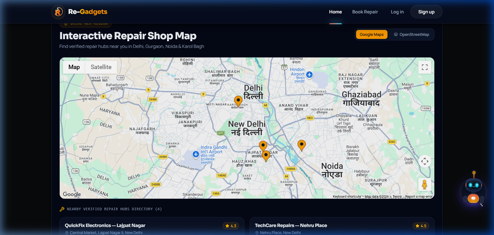
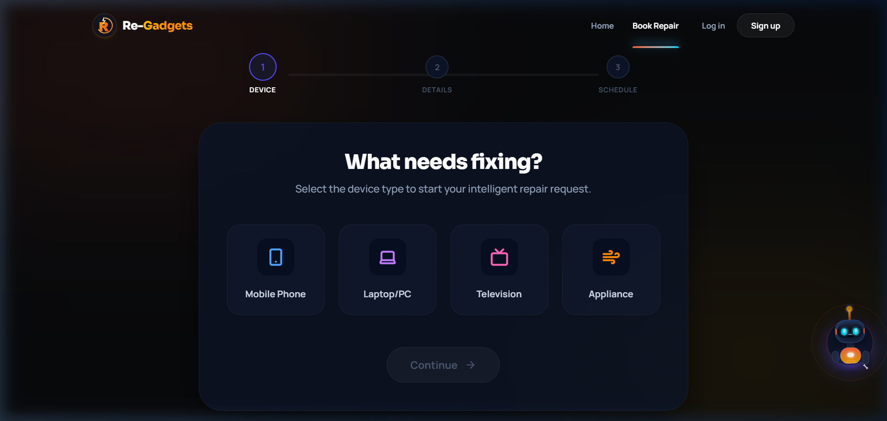
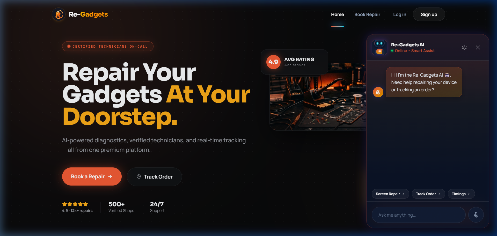
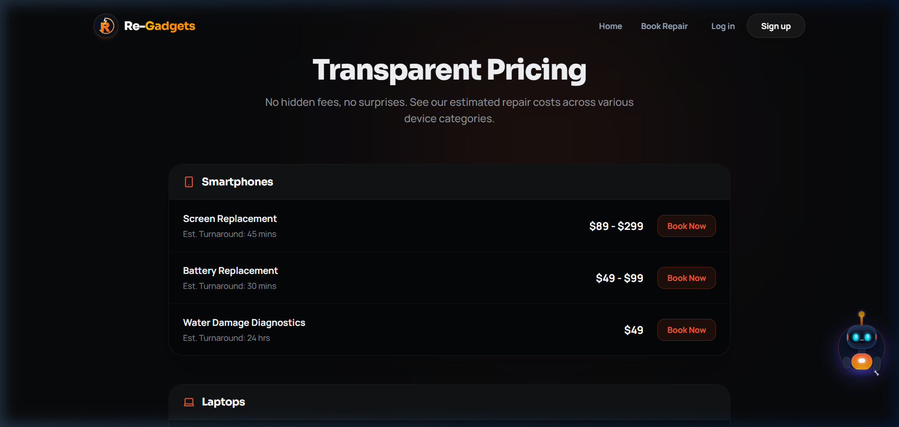
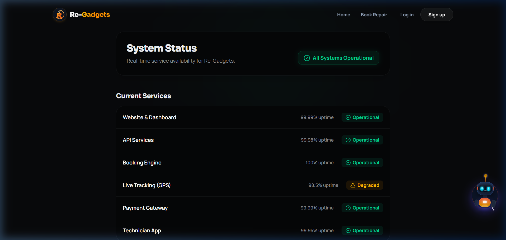

<div align="center">

# 🛠️ Re-Gadgets
### The Autonomous On-Demand Doorstep Electronics Repair Marketplace

[](https://react.dev)
[](https://nodejs.org)
[](https://mongodb.com)
[](https://tailwindcss.com)
[](https://ai.google.dev)
[](https://socket.io)

<p align="center">
  <b>A full-stack, enterprise-grade marketplace connecting customers with verified electronics repair hubs and mobile technicians.</b><br/>
  Featuring dual-engine interactive mapping, real-time Socket.IO dispatch tracking, bilingual Gemini AI diagnosis, and 4 dedicated role-based workspace portals.
</p>

[🌐 Live Production Web App](https://re-gadgets.vercel.app) • [⚡ Backend API Service](https://re-gadgets.onrender.com) • [📖 API Documentation](https://re-gadgets.vercel.app/platform/api) • [🟢 System Status](https://re-gadgets.vercel.app/status)

</div>

---

## 📸 Visual Showcase & Application Tour

<div align="center">

### 🌟 1. Futuristic Homepage & Hero Experience
*Complete with ambient ember blooms, 3D interactive hardware canvas, and certified repair metrics.*


</div>

<br/>

<table width="100%">
  <tr>
    <td width="50%" align="center">
      <b>🗺️ Interactive Repair Hub Map</b><br/>
      <i>Dual-engine (Google Maps + CartoDB Dark Leaflet) with auto-failover, custom amber pins & shop selector.</i><br/><br/>
      
    </td>
    <td width="50%" align="center">
      <b>📅 Multi-Step Doorstep Booking Wizard</b><br/>
      <i>Device selection, animated diagnostics checklist, interactive location selector, and cost quotes.</i><br/><br/>
      
    </td>
  </tr>
  <tr>
    <td width="50%" align="center">
      <b>🤖 Bilingual Gemini 1.5 AI Diagnostics</b><br/>
      <i>Natural voice/text speech recognition (English + Hinglish) with instant interactive action triggers.</i><br/><br/>
      
    </td>
    <td width="50%" align="center">
      <b>💳 Transparent Pricing & Protection Plans</b><br/>
      <i>Dynamic pricing tiers with instant Razorpay checkout integration and service warranty badges.</i><br/><br/>
      
    </td>
  </tr>
</table>

<div align="center">

### ⚡ Live Platform Health & Services Monitor
*Real-time operational status tracking API uptime, booking gateways, and GPS metrics across microservices.*



</div>

---

## 🎨 Design System & CSS Styling Architecture

Re-Gadgets is engineered from the ground up with a **sleek cyberpunk dark-mode aesthetic**, utilizing cutting-edge web design specifications:

### 1. OKLCH Perceptual Color Palette
Built using the modern **OKLCH color space** for ultra-vibrant contrast and perceptually uniform gradients:
* **Brand Ember / Primary Accent**: `oklch(0.65 0.19 35)` — Radiant amber flame with glowing drop-shadows.
* **Cyber Cyan / Highlights**: `oklch(0.75 0.15 195)` — Precision neon cyan for live telemetry, active pins, and status pulses.
* **Deep Space Slate**: `oklch(0.14 0.005 260)` to `oklch(0.18 0.006 260)` — Ultra-deep dark surface panels preventing eye fatigue.
* **Surface Glass Borders**: `oklch(0.28 0.008 260 / 0.5)` with `backdrop-filter: blur(16px)` for frosted glassmorphic cards.

### 2. Modern Typography Pairing
* **Display / Brand Headers**: `Sora` (Google Fonts) — Futuristic, bold geometric curves engineered for high-tech product headers.
* **Body & UI Elements**: `Manrope` (Google Fonts) — Clean, legible modern sans-serif optimized for dashboards and mobile screens.
* **Code & Telemetry**: `JetBrains Mono` — High-visibility monospace for order numbers, GPS coordinates, and API tokens.

### 3. Micro-Animations & Dynamic Physics
* **Framer Motion**: Smooth spring-based modal entrances, drag-to-snap robot mascot physics, and staggered card transitions.
* **Dual-Engine Mapping**: Seamless toggle and automatic fallback between Google Maps JavaScript API and Leaflet CartoDB Dark Matter tiles.
* **Magnetic Hover Buttons**: Subtle 3D scale and cursor tracking interactions on all primary CTA buttons.

---

## ⚡ Core Technical Capabilities

### 🤖 1. Gemini AI Voice & Diagnostic Companion
- **LLM Engine**: Powered by **Google Gemini 1.5 Flash** for rapid, accurate device diagnosis.
- **Bilingual Dialogue**: Speaks and understands both **English** and colloquial **Hinglish** (`en-IN`).
- **Web Speech API**: Integrated bidirectional speech-to-text (`SpeechRecognition`) and text-to-speech (`SpeechSynthesis`).
- **Interactive Action Contexts**: The assistant detects user intent and returns contextual buttons (`BOOK_REPAIR`, `TRACK_ORDER`, `CHECK_PRICE`) inside the chat stream.

### 🗺️ 2. Resilient Dual-Engine Geolocation & Tracking
- **Multi-Provider Mapping**: Primary Google Maps JavaScript API support paired with a zero-downtime **CartoDB Dark Matter OpenStreetMap (Leaflet)** fallback engine.
- **Zero-Downtime Fallback**: Catches `RefererNotAllowedMapError` or API key quota restrictions automatically to ensure the customer map never crashes.
- **Real-Time GPS Telemetry**: 5-stage order progression (`Requested ➔ Accepted ➔ Picked ➔ Repairing ➔ Delivered`) powered by **Socket.IO** with automatic REST polling fallback.

### 👥 3. 4-Tier Role-Based Dashboards
- **🧑‍💼 Customers**: Book repairs, upload diagnostic snapshots, pay securely via Razorpay, and monitor live technician transit.
- **🏬 Shop Owners**: Drag-and-drop Kanban order pipeline (`@hello-pangea/dnd`), technician dispatch assignment, and revenue analytics.
- **🔧 Technicians**: Mobile-first workbench checklist, spare parts requisition manager, and live transit route navigation.
- **🛡️ Administrators**: System-wide revenue metrics, merchant shop KYC verification, and user management controls.

### 🔒 4. Enterprise Security & Payments
- **Authentication**: Dual-layer JWT sessions (`httpOnly`, `SameSite: None; Secure` cookie tokens) + **Google OAuth 2.0**.
- **Media Pipeline**: Direct streaming Cloudinary uploads for device damage images and technician certificates.
- **Payment Processing**: End-to-end **Razorpay** checkout integration with cryptographic webhook signature validation.

---

## 📂 Project Structure

```
Re-Gadgets/
├── client/                           # React 19 Frontend (Vite 8 + Tailwind CSS v4)
│   ├── src/
│   │   ├── api/                      # Axios client with interceptors & JWT refresh handlers
│   │   ├── components/
│   │   │   ├── auth/                 # Controlled OTP inputs, social login buttons
│   │   │   ├── chat/                 # Gemini Mascot, Voice assistant, draggable chatbot
│   │   │   ├── dashboard/            # TopNavbar, RoleBadge, CommandPalette, TrackingModal
│   │   │   ├── home/                 # Hero, Services, RepairShopMap, Trust, FAQ sections
│   │   │   ├── map/                  # Dual-engine RepairShopMap, ShopInfoCard, Leaflet pins
│   │   │   └── ui/                   # Reusable Buttons, InputFields, glassmorphic Cards
│   │   ├── data/                     # Repair shops, blog posts, pricing tiers data
│   │   ├── hooks/                    # useVoiceAssistant, useCursorTracker
│   │   ├── pages/                    # Home, BookService, Tracking, Dashboards, Auth pages
│   │   ├── services/                 # AI service, socket service, order service
│   │   └── store/                    # Zustand centralized authentication store
│   ├── eslint.config.js              # Strict ESLint configuration (0 errors clean)
│   └── package.json
│
├── server/                           # Node.js + Express Backend Service
│   ├── api/                          # Serverless entrypoint
│   ├── config/                       # Mongoose connection pooling & Cloudinary client
│   ├── controllers/                  # Auth, order, shop, user, and AI controllers
│   ├── middleware/                   # JWT auth, role validation, rate limiting, multer
│   ├── models/                       # User, Order, Shop, and Review MongoDB schemas
│   ├── routes/                       # Express RESTful route declarations
│   ├── server.js                     # HTTP + Socket.IO real-time server
│   └── package.json
│
└── docs/
    └── screenshots/                  # High-resolution production application previews
```

---

## 🚀 Quickstart & Setup Guide

### Prerequisites
* **Node.js** >= 18.x
* **MongoDB** (Local instance or MongoDB Atlas cluster)
* Google Cloud Console Credentials (OAuth 2.0 + Maps JavaScript API)

### 1. Clone & Install Dependencies

```bash
# Clone the repository
git clone https://github.com/Yuvi4242/Re-Gadgets.git
cd Re-Gadgets

# Install backend dependencies
cd server
npm install

# Install frontend dependencies
cd ../client
npm install
```

### 2. Configure Environment Variables

**Backend (`server/.env`):**
```env
PORT=5000
NODE_ENV=development
MONGO_URI=mongodb://localhost:27017/regadgets
ACCESS_TOKEN_SECRET=your_jwt_access_secret_key
REFRESH_TOKEN_SECRET=your_jwt_refresh_secret_key
GEMINI_API_KEY=your_google_gemini_api_key
CLOUDINARY_CLOUD_NAME=your_cloudinary_cloud_name
CLOUDINARY_API_KEY=your_cloudinary_api_key
CLOUDINARY_API_SECRET=your_cloudinary_api_secret
CLIENT_URL=http://localhost:5173
```

**Frontend (`client/.env`):**
```env
VITE_API_URL=http://localhost:5000/api
VITE_GOOGLE_CLIENT_ID=your_google_client_id.apps.googleusercontent.com
VITE_GOOGLE_MAPS_API_KEY=your_google_maps_api_key
VITE_RAZORPAY_KEY_ID=rzp_test_your_key_id
```

### 3. Run Development Servers

```bash
# Terminal 1: Launch Backend API & WebSockets
cd server
npm run dev

# Terminal 2: Launch Vite Frontend with HMR
cd client
npm run dev
```

Visit `http://localhost:5173` to explore the live application.

---

## 🛠️ Verification & Build Commands

| Command | Action | Directory | Status |
| :--- | :--- | :--- | :--- |
| `npm run lint` | Runs static AST & ESLint inspection | `client/` | **Passing (0 Errors)** |
| `npm run build` | Compiles optimized Vite bundle | `client/` | **Built in 3.8s** |
| `npm run lint` | Syntax check for node scripts | `server/` | **Passing** |
| `npm run dev` | Launches HMR dev environment | `client/` or `server/` | **Active** |

---

## 👨‍💻 Author & Contributions

* **Creator**: [Yuvraj Singh](https://github.com/Yuvi4242)
* **LinkedIn**: [linkedin.com/in/yuvi42](https://www.linkedin.com/in/yuvi42/)
* **Portfolio / Live Demo**: [re-gadgets.vercel.app](https://re-gadgets.vercel.app)

<div align="center">

⭐ **Star this repository if you find it helpful!** ⭐
<Created by Alpha>
</div>
