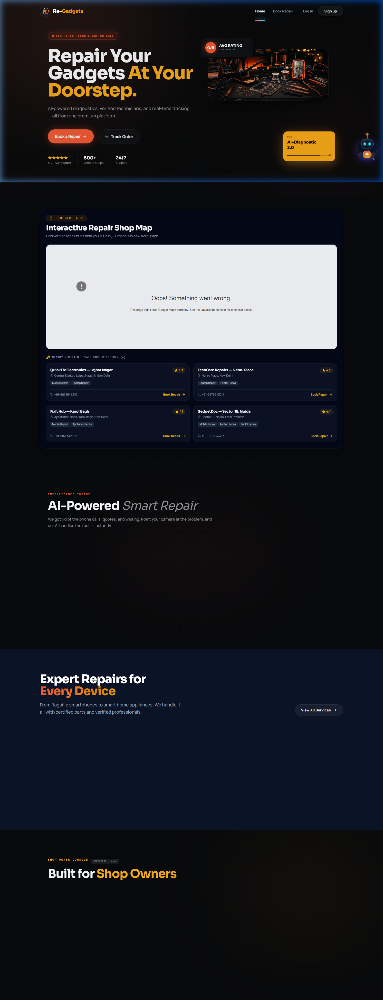

# 🛠️ Re-Gadgets — Premium Doorstep Gadget Repair Marketplace

[](https://react.dev)
[](https://nodejs.org)
[](https://expressjs.com)
[](https://mongodb.com)
[](https://tailwindcss.com)
[](https://socket.io)

**Re-Gadgets** is a premium, end-to-end doorstep gadget repair marketplace that connects customers with verified local repair shops and certified technicians. Featuring real-time order tracking, multi-role workspaces, automated invoice generation, and a bilingual AI-powered diagnostics assistant.

---

## 📸 Production Preview



*Live Deployments:*
- 🌐 **Frontend Application**: [re-gadgets.vercel.app](https://re-gadgets.vercel.app)
- ⚙️ **Backend Service API**: [re-gadgets.onrender.com](https://re-gadgets.onrender.com)

---

## ✨ Core Features

### 1. 🤖 Gemini AI-Powered Support Mascot
- Uses **Google Gemini 1.5 Flash** for natural dialogue.
- Full bilingual conversation support (**English & Hinglish**).
- Returns **contextual action buttons** (`BOOK_REPAIR`, `TRACK_ORDER`, `CHECK_PRICE`) based on chat context.
- Integrated voice input handler (`useVoiceAssistant.js`).

### 2. 📍 Real-Time Order tracking Pipeline
- Follows a strictly managed **5-stage order status progression**:
  `Requested ➔ Accepted ➔ Picked ➔ Repairing ➔ Delivered`
- Broadcasts updates instantly via **Socket.IO** with custom fallback REST polling triggers.

### 3. 👥 Multi-Role Dashboard Shell
- **Customers**: Create repair bookings, upload device diagnostics, check price quotes, track progress.
- **Shop Owners**: Kanban boards (`@hello-pangea/dnd`) for drag-and-drop technician dispatch and daily revenue analytics charts.
- **Technicians**: Interactive workbench order checklists and parts requesting tools.
- **Admins**: Account approvals, verified shop badges, and system-wide metrics panels.

### 4. 🔒 Enterprise Security & Storage
- Native **Cloudinary streaming upload engine** for profile photos and verified shop documents.
- Hashed passwords (bcrypt), JWT cookie sessions (`SameSite: None; Secure`), and Google OAuth 2.0 logins.

---

## 📂 Project Architecture

```
Re-Gadgets/
├── client/                     # Frontend Application (React 19 + Vite 8)
│   ├── src/
│   │   ├── api/
│   │   │   └── axiosInstance.js # Configured API client with refresh token interceptors
│   │   ├── components/
│   │   │   ├── chat/           # AI Mascot & Voice Input modules
│   │   │   ├── dashboard/      # Custom layouts, metrics & navigation bars
│   │   │   └── ui/             # Core design library (Button, Card, Input)
│   │   ├── context/
│   │   │   ├── AuthContext.jsx
│   │   │   └── ThemeContext.jsx
│   │   ├── hooks/
│   │   │   ├── useCursorTracker.js
│   │   │   └── useVoiceAssistant.js
│   │   ├── layouts/
│   │   │   └── DashboardLayout.jsx
│   │   ├── pages/
│   │   │   ├── Home.jsx
│   │   │   ├── BookService.jsx  # 3-Step intake wizard
│   │   │   ├── Tracking.jsx     # Live progress status
│   │   │   └── dashboards/      # Workspace variants (Customer, Shop, Tech, Admin)
│   │   └── services/
│   │       ├── aiService.js
│   │       └── socketService.js
│   ├── tailwind.config.js
│   └── package.json
│
└── server/                     # Backend API Service (Node + Express + Mongoose)
    ├── api/
    │   └── index.js            # Vercel Serverless Function entrypoint
    ├── app.js                  # Modular Express app definition & CORS filters
    ├── config/
    │   ├── db.js               # Serverless Mongoose connection pool cache
    │   └── cloudinary.js       # Custom streaming Cloudinary upload engine
    ├── controllers/            # Route controllers
    ├── middleware/             # Rate limiters & JWT validators
    ├── models/                 # MongoDB database schemas
    ├── routes/                 # Express routing mounts
    ├── validators/             # Express-validator sanitization arrays
    ├── package.json
    ├── server.js               # Dedicated Local Dev Server (HTTP + Socket.IO)
    └── vercel.json             # Serverless rewrites configuration
```

---

## 🚀 Local Quickstart

### Prerequisites
- Node.js version >= 18.x
- Running MongoDB instance

### 1. Set Up Environment Variables

Create `server/.env`:
```env
PORT=5000
MONGO_URI=mongodb://localhost:27017/regadgets
ACCESS_TOKEN_SECRET=your_access_secret_key
REFRESH_TOKEN_SECRET=your_refresh_secret_key
GEMINI_API_KEY=your_google_gemini_api_key
CLOUDINARY_CLOUD_NAME=your_cloud_name
CLOUDINARY_API_KEY=your_api_key
CLOUDINARY_API_SECRET=your_api_secret
```

Create `client/.env`:
```env
VITE_API_URL=http://localhost:5000/api
VITE_GOOGLE_CLIENT_ID=your_google_oauth_client_id.apps.googleusercontent.com
VITE_GOOGLE_MAPS_API_KEY=your_maps_api_key
VITE_RAZORPAY_KEY_ID=rzp_test_your_razorpay_key
```

### 2. Start the Backend Server
```bash
cd server
npm install
npm run dev
```

### 3. Start the Frontend Client
```bash
cd client
npm install
npm run dev
```

---

## 🛠️ Build and Lint Commands

| Command | Action | Folder |
| :--- | :--- | :--- |
| `npm run dev` | Runs application locally with HMR | `client/` or `server/` |
| `npm run build` | Compiles production assets | `client/` |
| `npm run lint` | Runs static syntax checks | `client/` or `server/` |
| `npm start` | Launches production app | `server/` |
